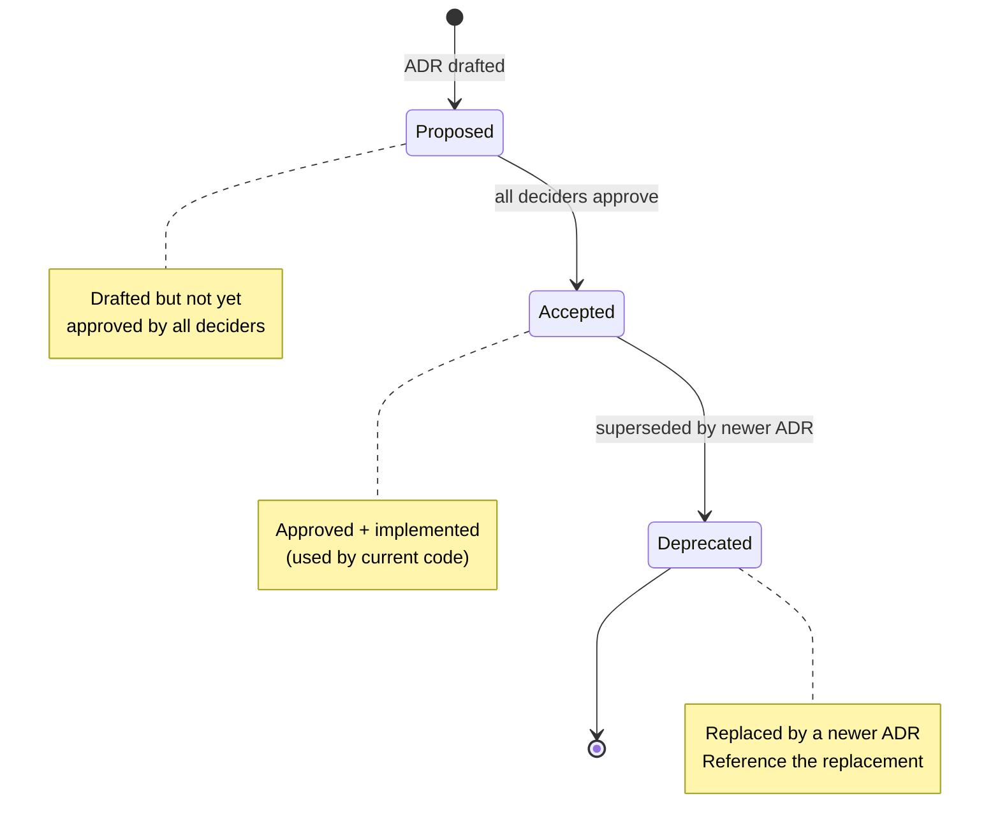

# Docs ADR Skill

Author or update an Architecture Decision Record (ADR). An ADR captures **a single significant technical decision**: the context, the options considered, the chosen option, and the consequences. Multiple ADRs may exist per feature — number them sequentially (`06_ADR-001_*.md`, `06_ADR-002_*.md`, ...).

## When to Use

Trigger this skill when:
- A significant technical decision is being made (database choice, framework choice, sync vs async, etc.)
- The technical design references "ADR-XXX" but the file does not yet exist
- The user asks to "document a decision" or "create an ADR"
- A decision was already made informally and needs to be recorded after the fact

Do NOT use when:
- The decision is trivial (e.g., variable naming, code style — use code comments)
- The decision is product-level (use the PRD)
- The decision is obvious from the technical design (no alternative was seriously considered)

**Heuristic for "significant"**: If a different option would have led to materially different code, schema, infra, deployment, or operational characteristics, it's worth an ADR.

## Input

```text
$ARGUMENTS
```

`$ARGUMENTS` should describe the decision in 1-2 sentences. Examples:
- `"Use Postgres instead of MongoDB for order storage"`
- `"Synchronous API vs background job for invoice generation"`
- `"Choose JWT vs session cookies for mobile auth"`

If the feature folder is unspecified, ask which feature this decision belongs to.

## Pre-Execution Checks (MANDATORY)

### Check 1 — Feature exists with technical design

```bash
.docs-scripts/check-feature-prereqs.sh \
  --feature "$FEATURE" \
  --requires "03_technical-design.md" \
  --json
```

ADRs typically reference technical design. If design is missing, ask user whether to proceed or run `docs-05-technical-design` first.

### Check 2 — Determine next ADR number and filename

```bash
.docs-scripts/next-adr-number.sh \
  --feature "$FEATURE" \
  --title "$DECISION_TITLE" \
  --json
```

Use the script output:

- `.next_number` → the ADR number to use (3-digit padded)
- `.suggested_file` → the canonical filename (`06_ADR-NNN_<slug>.md`)
- `.placeholder_present == true` → the template `06_ADR-001_[title].md` is still there. RENAME it to `.suggested_file` instead of creating a new file (`mv` not `cp`).
- `.existing_adrs[]` → existing ADRs in this feature (for cross-reference)

## Workflow

### Step 1: Locate feature folder

If `$ARGUMENTS` doesn't reference a feature folder, scan `docs/features/*/` and either:
- Use the most recently modified one
- Ask the user which feature this decision belongs to

### Step 2: Determine ADR number

Scan `docs/features/<feature>/06_ADR-*.md` to find existing ADRs. The next number is `max + 1`, padded to 3 digits (`001`, `002`, ..., `010`, ..., `100`).

If only the template `06_ADR-001_[title].md` exists (with placeholder filename), use `001` and rename it.

### Step 3: Generate filename

Format: `06_ADR-<NNN>_<short-title>.md`

Where `<short-title>` is:
- 2-5 words
- lowercase
- hyphenated
- describes the DECISION, not the problem

Examples:
- `06_ADR-001_postgres-for-orders.md`
- `06_ADR-002_async-invoice-generation.md`
- `06_ADR-003_jwt-mobile-auth.md`

### Step 4: Read context

Read in parallel:
- `docs/features/<feature>/03_technical-design.md` (the design that triggered the decision)
- `docs/features/<feature>/01_PRD.md` (constraints from requirements)
- `docs/features/<feature>/02_change-impact.md` (existing constraints)
- `docs/_common/architecture.md` (project-wide patterns to align with)
- `docs/_common/security-baseline.md` (if decision has security implications)
- The template at `docs/features/_template/06_ADR-001_[title].md`
- Existing ADRs in `docs/features/*/06_ADR-*.md` to learn the team's writing style

### Step 5: Author Context section

1-2 paragraphs explaining:
- What problem requires this decision
- The constraints (technical, business, organizational)
- The forces that make this decision non-trivial (e.g., performance vs simplicity, build vs buy)
- Why we cannot just defer the decision

Cite the FRs/NFRs from the PRD that drive the constraint.

### Step 6: Author Options table

List 2-4 realistic options. For each:
- `Option` — one-line name
- `Pros` — 2-4 bullet points of advantages
- `Cons` — 2-4 bullet points of disadvantages

**Quality bar**: All options must be plausible. "Don't do anything" or "build everything from scratch" are usually not real options. If you can only think of one option, the decision is not significant enough to warrant an ADR — use a code comment instead.

Be balanced — every option should have both pros and cons.

### Step 7: Author Decision

One sentence stating the chosen option, followed by a one-line rationale.

Format: `**[CHOSEN_OPTION]** — [ONE_LINE_REASON]`

Examples:
- `**Postgres** — operational maturity outweighs MongoDB's flexible schema for this domain`
- `**Async via SQS** — invoice generation tolerates 5min latency and allows horizontal scaling`

The rationale must clearly map to a specific Pro from the table.

### Step 8: Author Consequences

List 2-5 consequences as bullets:
- `✅` — positive consequences (must list at least 1)
- `⚠️ Trade-off:` — accepted trade-offs (must list at least 1)

Examples:
- ✅ Existing Postgres ops tooling (backups, monitoring, replicas) reused
- ✅ ACID guarantees match the order semantics
- ⚠️ Trade-off: Schema migrations require coordinated deployment vs MongoDB's flex schema
- ⚠️ Trade-off: JSONB queries are less ergonomic for nested data than MongoDB

Trade-offs are critical — they explain to future engineers what was knowingly given up.

### Step 9: Update header

Set:
- `**Created**`: today's date
- `**Status**`: `Proposed` for new decisions; `Accepted` once approved; `Deprecated` when superseded
- `**Deciders**`: from `git config user.name` plus any reviewers mentioned by user
- `**References**`: link to the technical design and any other relevant docs

### Step 10: Write file

Use `Write` (or `Edit` if amending) to save at the chosen filename. If the placeholder file `06_ADR-001_[title].md` exists, use `Bash mv` to rename it to the real filename, then write content.

Verify the existing technical design references this ADR. If it does not, suggest adding a 1-line reference in the design's relevant section: `> See [ADR-001](./06_ADR-001_<slug>.md) for the decision.`

### Step 11: Cross-link from technical design

Use `Edit` on `03_technical-design.md` to add a brief inline reference where the decision applies. Example:

```markdown
## Data model

> Decision rationale: see [ADR-001](./06_ADR-001_postgres-for-orders.md) for why Postgres was chosen.
```

This is critical for discoverability — future readers must be able to find the ADR from the design.

### Step 12: Report

```text
✅ ADR created: docs/features/<feature>/06_ADR-001_<slug>.md

Title: <one-line decision>
Status: Proposed
Deciders: <name>

Cross-link: added reference in 03_technical-design.md §<section>

Next steps:
  1. Get sign-off from co-deciders
  2. Update Status from Proposed → Accepted once approved
  3. If superseded later, mark Status: Deprecated and link to the replacement ADR
```

## Post-Execution Validation (MANDATORY)

```bash
.docs-scripts/validate-artifact.sh "$ADR_FILE" --json
```

Verify the ADR has all required structural elements:

- `Context`, `Options considered`, `Decision`, `Consequences` sections all present
- Status field set (`Proposed` for new, `Accepted` once approved)
- No leftover `[PLACEHOLDER]` tokens
- Filename matches the `.suggested_file` from `next-adr-number.sh`

## Quality Standards

- **One decision per ADR**: Don't bundle multiple unrelated decisions. Create separate ADRs.
- **Real alternatives**: Every option must have been realistically considered. No straw-man options.
- **Honest trade-offs**: List what's actually given up. ADRs without trade-offs are usually rationalization.
- **Future-readable**: Write so a new engineer joining the project in 2 years can understand WHY without context.
- **Immutable history**: Once Accepted, ADRs are amended only by creating a NEW ADR that supersedes the old one. Mark old as `Deprecated` and reference the new one. Don't delete or rewrite history.
- **Trace-able**: Every ADR is referenced from at least one technical design or other ADR. If nothing references it, it's not actually used.

## Status Lifecycle



| Status | Meaning |
| - | - |
| `Proposed` | Decision drafted but not yet approved by all deciders |
| `Accepted` | Approved and implemented (or being implemented) |
| `Deprecated` | Replaced by a newer decision; reference the replacement ADR |

## Edge Cases

| Situation | Action |
| - | - |
| Decision is reversing an earlier ADR | Mark old ADR `Deprecated`, add `**Superseded by**: [ADR-XXX](./06_ADR-XXX_*.md)`. New ADR's Context section explains why. |
| Decision is project-wide (not feature-specific) | Suggest moving to a project-level ADR location, or store at feature where first used and reference from `_common/architecture.md` |
| Decision has security implications | Add a `## Security implications` subsection between Decision and Consequences. Reference `_common/security-baseline.md` items. |
| Only one realistic option | Don't write an ADR. Use a code comment or technical design note. ADRs are for genuine choices. |
| Decision is recorded after the fact (post-implementation) | Write it anyway. Mark Status: `Accepted` immediately. Note in Context: "Recorded retroactively." |
| Multiple co-deciders disagree | Status remains `Proposed`. Add a `## Open dissent` subsection summarizing disagreement before resolving offline. |
| ADR references a dependency that may change | Note version in Context. If dependency is replaced, file a new ADR (don't edit old one). |

## Output

The skill produces:
- A new (or amended) ADR file at `docs/features/<feature>/06_ADR-<NNN>_<slug>.md`
- A cross-link added to `03_technical-design.md`
- A summary report with status and next steps

Never modify other ADRs except to mark them `Deprecated` when superseded. Never delete an existing ADR.
