# Hướng dẫn Workflow Tài liệu Feature

> Hướng dẫn sử dụng bộ **skills** và **agents** để tự động hoá việc viết, cập nhật và kiểm tra tài liệu tại `docs/` mỗi khi implement hoặc maintain một feature.
>
> File này nói về **cách dùng workflow**. Cấu trúc thư mục `docs/` được giải thích ở [`/README.md`](../README.md).

---

## Mục lục

1. [Tổng quan workflow](#1-tổng-quan-workflow)
2. [Cài đặt 1 lần cho project](#2-cài-đặt-1-lần-cho-project)
3. [Quy trình implement feature mới](#3-quy-trình-implement-feature-mới)
4. [Quy trình maintain / cập nhật feature](#4-quy-trình-maintain--cập-nhật-feature)
5. [Bảng tham khảo Skills](#5-bảng-tham-khảo-skills)
6. [Bảng tham khảo Agents](#6-bảng-tham-khảo-agents)
7. [Review Gates G1–G4](#7-review-gates-g1g4)
8. [Cách kích hoạt skill / agent](#8-cách-kích-hoạt-skill--agent)
9. [Mẹo hay khi dùng workflow](#9-mẹo-hay-khi-dùng-workflow)
10. [Troubleshooting](#10-troubleshooting)

---

## 1. Tổng quan workflow

Workflow này biến thư mục `docs/` thành một **lifecycle có kỷ luật** cho mọi feature, gồm 6 bước tài liệu + 4 review gates.

### Vòng đời tài liệu của 1 feature

```mermaid
flowchart TD
    Start([🚀 Bắt đầu project]) --> Bootstrap

    subgraph Setup ["🔧 Cài đặt 1 lần / project"]
        Bootstrap["<b>docs-01-bootstrap</b><br/>━━━━━━━━━━━━━<br/>📁 docs/_common/<br/>• architecture.md<br/>• api-conventions.md<br/>• security-baseline.md<br/>• test-strategy.md<br/>• glossary.md<br/>• review-gates.md"]
    end

    Bootstrap --> NewFeature

    subgraph PerFeature ["🎯 Lặp lại cho mỗi feature mới"]
        direction TB
        NewFeature["<b>docs-02-feature-new</b><br/>━━━━━━━━━━━━━<br/>📁 features/&lt;slug&gt;/<br/>copy 6 file template"]

        NewFeature --> PRD["<b>docs-03-prd</b> · Step 1<br/>━━━━━━━━━━━━━<br/>📄 01_PRD.md<br/>Problem · FRs · NFRs<br/>Acceptance criteria"]

        PRD --> G1{{"🚦 Gate G1<br/>PRD Review"}}
        G1 -->|❌ FAIL: sửa| PRD
        G1 -->|✅ PASS| Impact

        Impact["<b>docs-04-change-impact</b> · Step 2<br/>━━━━━━━━━━━━━<br/>📄 02_change-impact.md<br/>Affected components<br/>Breaking changes · Risks"]

        Impact --> Design["<b>docs-05-technical-design</b> · Step 3<br/>━━━━━━━━━━━━━<br/>📄 03_technical-design.md<br/>Data model · API · Logic<br/>Sequence diagrams · Auth"]

        Design -.->|"💡 nếu có decision lớn"| ADR["<b>docs-08-adr</b> · Step 6<br/>━━━━━━━━━━━━━<br/>📄 06_ADR-NNN_*.md<br/>Context · Options<br/>Decision · Trade-offs"]
        ADR -.-> G2

        Design --> G2{{"🚦 Gate G2<br/>Design Review"}}
        G2 -->|❌ FAIL: sửa| Design
        G2 -->|✅ PASS| TestPlan

        TestPlan["<b>docs-06-test-plan</b> · Step 4<br/>━━━━━━━━━━━━━<br/>📄 04_test-plan.md<br/>Unit · API · E2E<br/>Performance · Regression"]

        TestPlan --> Trace["<b>docs-07-traceability</b> · Step 5<br/>━━━━━━━━━━━━━<br/>📄 05_traceability-matrix.md<br/>FR ↔ Design ↔ Endpoint<br/>↔ Test IDs ↔ Status"]

        Trace --> Code[/"💻 Implement code<br/>+ chạy test thực tế<br/>━━━━━━━━━━━━━<br/>Update matrix status<br/>⬜ → 🔄 → ✅"/]

        Code --> G3{{"🚦 Gate G3<br/>Code Review"}}
        G3 -->|❌ FAIL: sửa code| Code
        G3 -->|✅ PASS| G4{{"🚦 Gate G4<br/>QA Sign-off"}}
        G4 -->|❌ FAIL: fix bug| Code
        G4 -->|✅ PASS| Ship
    end

    Ship([🎉 Ship lên production])

    classDef setupStyle fill:#e1f5ff,stroke:#0288d1,stroke-width:2px,color:#01579b
    classDef skillStyle fill:#f3e5f5,stroke:#7b1fa2,stroke-width:2px,color:#4a148c
    classDef gateStyle fill:#fff9c4,stroke:#f57f17,stroke-width:3px,color:#e65100
    classDef codeStyle fill:#e8f5e9,stroke:#388e3c,stroke-width:2px,color:#1b5e20
    classDef terminalStyle fill:#fce4ec,stroke:#c2185b,stroke-width:2px,color:#880e4f
    classDef adrStyle fill:#fff3e0,stroke:#ef6c00,stroke-width:2px,color:#e65100,stroke-dasharray: 5 5

    class Bootstrap setupStyle
    class NewFeature,PRD,Impact,Design,TestPlan,Trace skillStyle
    class G1,G2,G3,G4 gateStyle
    class Code codeStyle
    class Start,Ship terminalStyle
    class ADR adrStyle
```



> 💡 **Đọc diagram**:
> - **Hộp tím** là các skill workflow (1 skill = 1 step trong lifecycle).
> - **Hình thoi vàng** là review gate (G1-G4) — mỗi gate có nhánh PASS/FAIL quay lại sửa.
> - **Đường nét đứt** đến `docs-08-adr` nghĩa là **tuỳ chọn**: chỉ tạo ADR khi có quyết định kiến trúc đáng kể.
> - **Hộp xanh lá** là bước viết code (ngoài phạm vi tài liệu nhưng nằm giữa lifecycle).

### Nguyên tắc thiết kế

- **Một skill = một bước**: Mỗi tài liệu (`01_PRD.md`, `02_change-impact.md`, …) có 1 skill chuyên trách.
- **Trigger tự nhiên**: Skills tự kích hoạt khi bạn nói câu phù hợp ("viết PRD cho feature X", "tạo change impact", …).
- **Evidence-based**: Tất cả skills/agents bắt buộc trích dẫn nguồn (file path, line number) — không bịa giá trị.
- **Idempotent**: Chạy lại skill nhiều lần sẽ không đè lên phần bạn đã sửa tay.
- **Optional sections**: Nếu một mục không áp dụng (vd. feature không có UI → bỏ section Frontend), skill xoá hẳn — không để placeholder rỗng.

---

## 2. Cài đặt 1 lần cho project

Bước này chỉ làm **1 lần khi mới setup project**, hoặc khi codebase có thay đổi lớn về kiến trúc.

### Bước 2.1 — Bootstrap `_common/`

Mở Claude Code trong project, gõ:

```text
Bootstrap docs cho project này
```

hoặc

```text
Init docs/_common từ codebase
```

Skill `docs-01-bootstrap` sẽ:

1. Quét codebase (qua agent `docs-codebase-analyzer`).
2. Tự fill 6 file trong `docs/_common/`:
   - `architecture.md` — sơ đồ hệ thống, layers, observability
   - `api-conventions.md` — base URL, auth, error shape, pagination
   - `security-baseline.md` — OWASP checklist với evidence từ codebase
   - `test-strategy.md` — pyramid, tooling, coverage targets
   - `glossary.md` — domain terms từ entity/model files
   - `review-gates.md` — checklist G1-G4 (giữ nguyên template, bạn customize role nếu cần)
3. Đánh dấu `> NEEDS EVIDENCE: <gì>` cho những chỗ không tìm được dữ liệu (không bịa).

### Bước 2.2 — Review & customize `_common/`

Mở từng file `_common/*.md`, kiểm tra:

- ✅ Sửa các chỗ `> NEEDS EVIDENCE` nếu bạn biết câu trả lời.
- ✅ Đặt đúng `[REVIEWER_NAME]` trong `review-gates.md` (Tech Lead, QA, …).
- ✅ Bổ sung domain terms vào `glossary.md` nếu agent bỏ sót.

> 💡 **Tip**: `_common/` là nguồn tham chiếu cho mọi feature. Đầu tư 30 phút làm tốt → tiết kiệm hàng giờ ở mỗi feature sau.

---

## 3. Quy trình implement feature mới

Áp dụng cho mỗi feature mới. Mỗi bước gắn với 1 skill — bạn chỉ cần nói câu lệnh tự nhiên, skill sẽ tự kích hoạt.

### Bước 3.1 — Scaffold thư mục feature

```text
Tạo feature mới: cho phép user đăng nhập bằng OAuth2
```

→ Skill `docs-02-feature-new` sẽ:

- Sinh slug (vd. `user-auth-oauth2`).
- Đánh số (vd. `001-`, `002-` theo `init-options.json`).
- Copy `_template/` sang `docs/features/<NNN>-<slug>/`.
- Pre-fill `[AUTHOR]` (từ `git config user.name`) và `[DATE]` cho cả 6 file.

### Bước 3.2 — Viết PRD (Step 1)

```text
Viết PRD cho feature OAuth2 login
```

→ Skill `docs-03-prd` sẽ:

- Đọc template `01_PRD.md` + `_common/glossary.md` để lấy domain terms.
- Hỏi tối đa 3 câu clarification quan trọng nhất (nếu cần).
- Sinh các section: Problem, Solution, Non-goals, Functional Requirements (FR-001…), NFRs, Acceptance Criteria, Success Metrics.
- Self-validate theo checklist Gate G1.
- Báo cáo: số FR (P0/P1/P2), NFRs, open questions còn lại.

> ⚠️ **Quan trọng**: PRD chỉ mô tả **WHAT & WHY**. Không nhắc đến framework, library, database, code structure — đó là việc của technical design.

### Bước 3.3 — Chạy gate G1 (PRD Review)

Trước khi qua step 3, đảm bảo PRD đạt chất lượng:

```text
Run G1 cho feature user-auth-oauth2
```

→ Skill `docs-09-review-gate` chạy checklist G1, in báo cáo PASS / FAIL / WARNINGS, kèm fix cụ thể.

Nếu FAIL → quay lại step 3.2 sửa, rồi chạy lại G1.

### Bước 3.4 — Đánh giá tác động (Step 2)

```text
Phân tích change impact cho feature OAuth2
```

→ Skill `docs-04-change-impact` sẽ:

- Đọc PRD + `_common/architecture.md`.
- Quét codebase tìm component bị ảnh hưởng (qua `docs-codebase-analyzer` nếu cần).
- Phân loại: 🔴 High / 🟡 Medium / 🟢 Low.
- Liệt kê breaking changes + migration plan.
- Sinh regression checklist từ test suites bị ảnh hưởng.
- Risk register cho các rủi ro Medium/High.

> 💡 Nếu là greenfield (không đụng code cũ) → file chỉ có 1 dòng `> No impact` và xong.

### Bước 3.5 — Viết technical design (Step 3)

```text
Viết technical design cho OAuth2 login
```

→ Skill `docs-05-technical-design` sẽ tạo các section áp dụng:

| Section | Khi nào có |
| - | - |
| Overview | Luôn luôn |
| Data model + Migration (Up/Down) | Khi có DB change |
| API endpoints + Authorization | Khi có HTTP/RPC |
| Business logic | Khi không phải pure CRUD |
| Sequence diagrams (Mermaid) | Multi-service / async / complex |
| Frontend (screens, data flow) | Khi có UI |
| Observability | Khi có signals đặc thù |

Skill tự bỏ section không áp dụng (không để placeholder rỗng).

### Bước 3.6 — Tạo ADR khi cần (Step 6)

Khi technical design có quyết định kiến trúc đáng chú ý ("chọn Postgres thay vì Mongo", "async thay vì sync", …):

```text
Tạo ADR: chọn Postgres thay vì Mongo cho orders
```

→ Skill `docs-08-adr` sẽ:

- Tự đánh số (`06_ADR-001_*`, `06_ADR-002_*`, …).
- Đặt tên file đẹp (`06_ADR-001_postgres-for-orders.md`).
- Viết Context, Options (2-4 lựa chọn thực sự), Decision, Consequences (✅ + ⚠️ trade-offs).
- Tự thêm cross-link từ `03_technical-design.md` đến ADR.

### Bước 3.7 — Chạy gate G2 (Design Review)

```text
Run G2 cho user-auth-oauth2
```

Skill `docs-09-review-gate` cross-check:

- Data model có đủ entity/field/constraint?
- Migration có cả Up & Down?
- Mọi FR có endpoint tương ứng?
- Authorization có row cho mọi endpoint cần auth?
- Sequence diagrams có cho non-trivial flows?
- Security checklist từ `security-baseline.md` đã được address?
- ADR có cho mọi decision đáng kể?
- Risk register không còn 🔴 chưa mitigate?

### Bước 3.8 — Sinh test plan (Step 4)

```text
Tạo test plan cho feature OAuth2
```

→ Skill `docs-06-test-plan` (kết hợp agent `docs-test-generator`) sẽ:

- Sinh test cases ở 5 layer:
  - **Unit** — mỗi business logic method × mỗi branch × mỗi validation rule × mỗi error condition × edge cases.
  - **API** — mỗi endpoint × mỗi status code áp dụng (200, 400, 401, 403, 404, 409, 422).
  - **E2E** — chỉ critical journeys (3-7 cases).
  - **Performance** — chỉ khi có Performance NFR.
  - **Regression** — copy từ change impact.
- Đặt ID theo format từ `_common/test-strategy.md` (default: `TC-U-XXX`, `TC-A-XXX`, …).
- Báo cáo coverage: FR nào còn thiếu test.

### Bước 3.9 — Build traceability matrix (Step 5)

```text
Tạo traceability matrix
```

→ Skill `docs-07-traceability` sẽ:

- Map mỗi FR ↔ design section ↔ endpoint ↔ test case IDs.
- Trạng thái: ⬜ chưa có test / 🔄 đang chạy / ✅ pass / ❌ fail.
- Tính coverage: Total FRs / Have test / Passing.
- Phát hiện gaps: FR không có test, FR không có endpoint, …

> 💡 Khi feature lớn (>15 FRs), workflow tự dispatch agent `docs-traceability-auditor` để verify mapping độc lập.

### Bước 3.10 — Implement code + chạy test thật

Đây là bước **viết code** (ngoài phạm vi tài liệu). Sau khi code xong:

- Cập nhật `05_traceability-matrix.md` status từ ⬜ → ✅ khi test pass (qua skill `docs-07-traceability` hoặc sửa tay).
- Chạy G3 và G4 → nếu PASS, test plan sẽ **tự động transition** sang `Approved` (không cần can thiệp tay).

### Bước 3.11 — Gates G3 & G4 trước khi ship

```text
Run G3 cho user-auth-oauth2
```

Gate G3 (Code Review) cross-check code thực tế:

- Code có match design?
- Có hardcoded secrets?
- Có authorization check trên mọi endpoint mutating?
- Có `console.log`/debug code sót?

```text
Run G4 cho user-auth-oauth2
```

Gate G4 (QA Sign-off):

- Mọi FR trong matrix đều ✅?
- Regression suite 100% pass?
- Exit criteria từ test plan đạt?

→ Khi G4 PASS → feature sẵn sàng ship.

---

## 4. Quy trình maintain / cập nhật feature

Khi feature đã có docs đầy đủ và bạn cần sửa đổi:

### Tình huống A — Thêm FR mới vào feature có sẵn

1. Mở `01_PRD.md`, gõ:
   ```text
   Update PRD feature user-auth-oauth2: thêm FR cho 2FA via TOTP
   ```
   → Skill `docs-03-prd` sẽ thêm FR mới, không đụng FR cũ.

2. Nếu FR mới làm thay đổi tác động:
   ```text
   Update change impact cho user-auth-oauth2
   ```

3. Nếu FR mới cần sửa design:
   ```text
   Update technical design cho user-auth-oauth2 với 2FA
   ```

4. Sinh test cases bổ sung:
   ```text
   Update test plan cho user-auth-oauth2
   ```
   → Skill tự đánh số tiếp (vd. `TC-U-006` nếu đã có TC-U-005).

5. Refresh matrix:
   ```text
   Update traceability matrix cho user-auth-oauth2
   ```

6. Re-run các gate cần thiết (G1 → G4).

### Tình huống B — Refactor không đổi behavior

Nếu refactor không đổi FR/API/test:

1. Có thể chỉ cần tạo ADR ghi lại quyết định:
   ```text
   Tạo ADR: refactor auth middleware sang strategy pattern
   ```
2. Cập nhật `03_technical-design.md` mục bị ảnh hưởng (qua skill `docs-05-technical-design`).
3. Re-run G2 nếu thay đổi đáng kể.

### Tình huống C — Phát hiện bug & cần sửa docs

1. Sửa `01_PRD.md` để clarify FR (qua `docs-03-prd`).
2. Update test cases tương ứng (qua `docs-06-test-plan`).
3. Refresh matrix.
4. Re-run G1 nếu PRD đổi materially.

### Tình huống D — Codebase đổi lớn → cần refresh `_common/`

```text
Refresh docs/_common/architecture.md vì mới thêm Redis và worker service
```

→ Skill `docs-01-bootstrap` chạy chế độ refresh, chỉ update file được nhắc đến.

---

## 5. Bảng tham khảo Skills

| Skill | Trigger phrases tiếng Việt | Output | Step | Gate |
| - | - | - | - | - |
| `docs-01-bootstrap` | "bootstrap docs", "init _common", "khởi tạo docs project" | `docs/_common/*.md` | Setup | — |
| `docs-02-feature-new` | "tạo feature mới", "scaffold docs cho feature", "thư mục feature mới" | `docs/features/<slug>/` | Setup | — |
| `docs-03-prd` | "viết PRD", "update PRD", "draft requirements" | `01_PRD.md` | 1 | G1 |
| `docs-04-change-impact` | "phân tích change impact", "đánh giá tác động", "breaking changes" | `02_change-impact.md` | 2 | — |
| `docs-05-technical-design` | "viết technical design", "draft tech design", "design API endpoints" | `03_technical-design.md` | 3 | G2 |
| `docs-06-test-plan` | "viết test plan", "tạo test cases", "QA plan" | `04_test-plan.md` | 4 | — |
| `docs-07-traceability` | "build traceability matrix", "map FR sang test", "check FR coverage" | `05_traceability-matrix.md` | 5 | G4 |
| `docs-08-adr` | "tạo ADR", "ghi quyết định kiến trúc", "document decision" | `06_ADR-XXX_*.md` | 6 | — |
| `docs-09-review-gate` | "run gate G1/G2/G3/G4", "validate review", "check sẵn sàng" | Console report (+ optional `.gate-history.md`) | — | G1-G4 |

> 💡 **Trigger linh hoạt**: Bạn không cần nói chính xác cụm từ trên. Skill description liệt kê nhiều cụm phổ biến. Cứ nói tự nhiên — Claude sẽ chọn skill phù hợp.

---

## 6. Bảng tham khảo Agents

Agents là **subprocess tự động** chạy nhiều bước trong nền, trả report về cho main thread. Bạn ít khi gọi trực tiếp; các skills sẽ tự dispatch khi cần.

| Agent | Vai trò | Tools | Khi nào tự chạy |
| - | - | - | - |
| `docs-codebase-analyzer` 🔵 | Khảo sát codebase, trả report architecture/API/security/test/glossary có cite file paths | Read, Grep, Glob, Bash | Khi `docs-01-bootstrap` hoặc `docs-04-change-impact` cần map codebase |
| `docs-test-generator` 🟣 | Sinh test cases (Unit/API/E2E/Perf/Regression) từ PRD + tech design, kèm coverage map | Read, Grep, Glob | Khi `docs-06-test-plan` cần exhaustive enumeration |
| `docs-traceability-auditor` 🟡 | Audit độc lập matrix, phát hiện wrong mapping, orphan tests, stale entries | Read, Grep, Glob | Khi feature có >15 FRs hoặc khi user yêu cầu audit |
| `docs-review-gate-validator` 🟡 | Chạy checklist G1-G4 với evidence-based verdict | Read, Grep, Glob, Bash | Khi `docs-09-review-gate` cần evaluation chi tiết |

### Gọi agent thủ công (nếu cần)

```text
Dispatch docs-codebase-analyzer để khảo sát kiến trúc project hiện tại
```

```text
Dùng docs-traceability-auditor verify matrix của feature user-auth
```

---

## 7. Review Gates G1–G4

4 cổng kiểm soát chất lượng. Mỗi feature phải qua đủ 4 gate trước khi ship.

| Gate | Tên | Khi nào | Artifacts kiểm tra | Block nếu fail? |
| - | - | - | - | - |
| **G1** | PRD Review | Trước khi bắt đầu design | `01_PRD.md` | ✅ — không thể qua design |
| **G2** | Design Review | Trước khi viết code | `02_change-impact.md`, `03_technical-design.md`, `06_ADR-*.md` | ✅ — không thể qua implementation |
| **G3** | Code Review | Trước khi merge | Source code, tests, migrations | ✅ — không thể merge |
| **G4** | QA Sign-off | Trước khi ship | `04_test-plan.md`, `05_traceability-matrix.md`, test results | ✅ — không thể ship |

### Cách chạy gate

```text
Run G1 cho feature user-auth-oauth2
Run G2 cho user-auth-oauth2
Run G3
Run G4
```

Skill `docs-09-review-gate` đọc checklist từ `_common/review-gates.md`, chấm từng item:

- ✅ Pass — đạt
- ⚠️ Partial — có vấn đề nhỏ, có thể proceed nếu reviewer chấp nhận
- ❌ Fail — phải sửa
- ⊘ N/A — không áp dụng

**Verdict**:

- **PASS** = mọi item ✅ hoặc ⊘
- **PASS WITH WARNINGS** = có ⚠️ nhưng không có ❌
- **FAIL** = có ít nhất 1 ❌

> 💡 Thêm flag `--strict` để treat ⚠️ thành ❌:
>
> ```text
> Run G2 cho user-auth-oauth2 --strict
> ```

---

## 8. Cách kích hoạt skill / agent

### Cách 1 — Nói tự nhiên (khuyến khích)

Cứ gõ câu lệnh tự nhiên bằng tiếng Việt hoặc tiếng Anh:

```text
Viết PRD cho tính năng đăng nhập Google
```

Claude sẽ tự nhận diện skill phù hợp (`docs-03-prd`) qua trigger phrases trong description.

### Cách 2 — Slash command (nếu được cấu hình)

Một số môi trường hỗ trợ:

```text
/docs-03-prd Đăng nhập Google
/docs-02-feature-new Push notification preferences
/docs-09-review-gate G2
```

### Cách 3 — Yêu cầu tường minh

Nếu Claude không tự pick được skill đúng:

```text
Dùng skill docs-06-test-plan để sinh test cases cho feature OAuth2
```

### Cách 4 — Pipeline cả workflow

Bạn có thể yêu cầu chạy nhiều bước liên tục:

```text
Cho tôi full workflow cho feature mới: gửi email reset password.
Bắt đầu từ scaffold đến PRD, change impact, technical design.
Dừng lại trước test plan để tôi review.
```

Claude sẽ tự gọi `docs-02-feature-new` → `docs-03-prd` → `docs-04-change-impact` → `docs-05-technical-design` tuần tự.

---

## 9. Mẹo hay khi dùng workflow

### 9.1. Đặt slug feature ngắn gọn, dễ nhớ

✅ `user-auth-oauth2`, `nightly-invoice-job`, `push-notif-prefs`
❌ `the-feature-for-handling-user-authentication-via-oauth2`

### 9.2. Chạy gate sớm và thường xuyên

Đừng đợi viết xong hết mới chạy gate. Chạy G1 ngay sau khi PRD draft xong → phát hiện thiếu sót sớm.

### 9.3. Maximum 3 `[NEEDS CLARIFICATION]` trong PRD

Nếu phải hỏi nhiều hơn 3 câu → vấn đề chưa đủ rõ để viết PRD. Quay lại brainstorm.

### 9.4. ADR chỉ cho **decision đáng kể**

Đừng tạo ADR cho mọi quyết định nhỏ. Tiêu chuẩn: nếu chọn option khác sẽ dẫn đến code/schema/infra/ops khác biệt **rõ rệt** → đáng có ADR.

### 9.5. Đừng duplicate giữa `_common/` và per-feature

❌ Sai: copy auth scheme từ `_common/api-conventions.md` vào `03_technical-design.md`.
✅ Đúng: link bằng quote `> Auth conventions → _common/api-conventions.md`.

### 9.6. Status discipline (auto-transitions)

Workflow chạy theo nguyên tắc **minimum human-in-the-loop**: skill tự set và gate tự transition. User chỉ can thiệp khi gate FAIL hoặc muốn revert.

| Status | Ý nghĩa | Ai set? |
| - | - | - |
| `Draft` | Nội dung đã viết, chưa qua gate | Skill (`set-status.sh --only-if-unset` tự set khi scaffold hoặc khi Post-Execution của 03/04/05/06) |
| `Approved` | Gate đã PASS, không sửa nữa | Gate skill (`docs-09-review-gate` tự set khi verdict = PASS) |
| `Proposed` | ADR mới tạo, chưa qua G2 | Skill (`docs-08-adr`) |
| `Accepted` | ADR đã được G2 PASS | Gate skill (G2 PASS → Accepted) |
| `Deprecated` | ADR bị supersede | **Manual** — user tạo ADR mới và set Deprecated trên ADR cũ |
| `Living document` | Matrix không có lifecycle | Template mặc định, không đổi |

**Không còn bước `In Review` thủ công** — gate PASS là sign-off. Nếu user muốn xem xét kỹ trước khi chạy gate, cứ đọc file trực tiếp và chỉ chạy gate khi đã sẵn sàng.

**Nếu gate FAIL**: artifacts giữ nguyên status (Draft / Proposed). Fix nội dung rồi chạy lại gate.

**Nếu gate PASS_WITH_WARNINGS**: auto-transition luôn (vẫn Approved), nhưng warnings được log vào `.gate-history.md`. Nếu team muốn warnings block transition, chạy gate với flag `--strict`.

### 9.7. `_common/` là **source of truth**

Khi codebase đổi (vd. đổi DB, đổi auth scheme, đổi error format) → **cập nhật `_common/` trước**, rồi mới điều chỉnh per-feature.

### 9.8. Tận dụng cross-link

Cả 6 file feature đều reference lẫn nhau qua relative path. Khi đọc `03_technical-design.md` mà không hiểu một thuật ngữ → click sang `_common/glossary.md`.

### 9.9. Đừng ngại re-run skill

Skill là idempotent. Chạy `docs-03-prd` lần thứ 2 sẽ không xoá nội dung bạn đã sửa tay — chỉ điền các placeholder còn lại.

### 9.10. Vietnamese-friendly

Skills hỗ trợ viết nội dung tiếng Việt cho project tiếng Việt. Giữ nguyên IDs (FR-001, P0, TC-U-001) và headers tiếng Anh để consistency.

---

## 10. Troubleshooting

### Skill không tự kích hoạt khi tôi nói

**Nguyên nhân**: Câu lệnh không chứa trigger phrases.

**Cách fix**:

- Dùng từ khoá rõ ràng hơn: thay vì "làm cái docs cho tôi" → "viết PRD cho feature X".
- Hoặc gọi tường minh: "Dùng skill docs-03-prd để…".
- Hoặc check `.claude/skills/<skill>/SKILL.md` mục `description` để xem các cụm từ chính xác.

### Skill báo "missing prerequisite"

**Ví dụ**: `docs-05-technical-design` báo "01_PRD.md not found".

**Cách fix**: Chạy skill ở step trước. Workflow theo thứ tự:

```text
docs-02-feature-new → docs-03-prd → docs-04-change-impact → docs-05-technical-design → ...
```

Không skip bước.

### Gate luôn FAIL ở 1 item

**Cách fix**: Đọc kỹ phần "Suggested fix" trong báo cáo gate. Mỗi ❌ kèm action cụ thể (file nào sửa, skill nào chạy lại).

Nếu không đồng ý với verdict → có thể là item không áp dụng cho feature của bạn → mark `⊘ N/A` thủ công bằng cách sửa `_common/review-gates.md` để loại item đó khỏi gate (cẩn thận, ảnh hưởng mọi feature).

### Agent "không tìm thấy"

**Nguyên nhân**: Agents nằm ở `.claude/agents/` chứ không phải `.claude/skills/`. Nếu bạn dispatch agent bằng tên không tồn tại, Claude sẽ báo lỗi.

**Cách fix**: Tên agent đầy đủ là:

- `docs-codebase-analyzer`
- `docs-test-generator`
- `docs-traceability-auditor`
- `docs-review-gate-validator`

### Matrix báo "stale row"

**Nguyên nhân**: PRD đã bỏ FR-XXX nhưng matrix còn row cho FR đó.

**Cách fix**: Re-run `docs-07-traceability` → skill tự xoá row stale.

### `_common/` file vẫn còn placeholder sau khi bootstrap

**Nguyên nhân**: Codebase chưa có evidence rõ (vd. không có CI config → `test-strategy.md` ko fill được CI gates).

**Cách fix**:

- Đọc dòng `> NEEDS EVIDENCE: <gì>` để biết skill cần info gì.
- Sửa tay rồi save.
- Hoặc bổ sung config thật vào project và re-run `docs-01-bootstrap` với flag `--force`.

### Tôi muốn dùng workflow này cho project khác

Copy **3 thư mục** (skills, agents, scripts):

```bash
cp -r .claude/skills/docs-* <project-mới>/.claude/skills/
cp -r .claude/agents/docs-*.md <project-mới>/.claude/agents/
cp -r .docs-scripts <project-mới>/.docs-scripts
chmod +x <project-mới>/.docs-scripts/*.sh
```

> ⚠️ Đừng quên `.docs-scripts/` — đây là phần **deterministic check** mà mọi skill bắt buộc phải gọi qua Pre/Post-Execution sections. Thiếu folder này thì skills sẽ fail ở bước đầu tiên.

Đảm bảo `<project-mới>` cũng có:

- `docs/features/_template/` 6 file template (PRD, change-impact, technical-design, test-plan, traceability-matrix, ADR)
- `docs/_common/` 6 file template (architecture, api-conventions, security-baseline, test-strategy, glossary, review-gates)
- `jq` và `bash` đã cài (macOS/Linux có sẵn; `brew install jq` nếu thiếu)

> 💡 Numbering mode: mặc định là `sequential` (`001-`, `002-`, ...). Nếu muốn dùng timestamp prefix, gọi `docs-02-feature-new` với flag `--timestamp` (sẽ thành `YYYYMMDD-HHMMSS-slug/`). Workflow này **không phụ thuộc vào `.specify/`** nào — hoàn toàn độc lập.

Chạy `docs-01-bootstrap` để init.

---

## Tài liệu liên quan

- [`/README.md`](../README.md) — Cấu trúc thư mục `docs/` (tiếng Anh)
- [`_common/architecture.md`](./_common/architecture.md) — Sơ đồ hệ thống project
- [`_common/api-conventions.md`](./_common/api-conventions.md) — Quy ước API
- [`_common/test-strategy.md`](./_common/test-strategy.md) — Chiến lược test
- [`_common/security-baseline.md`](./_common/security-baseline.md) — Security checklist
- [`_common/glossary.md`](./_common/glossary.md) — Thuật ngữ
- [`_common/review-gates.md`](./_common/review-gates.md) — Định nghĩa 4 gates
- [`features/_template/`](./features/_template/) — Template 6 file cho feature mới

### File định nghĩa skill / agent

- `.claude/skills/docs-*/SKILL.md` — Định nghĩa 9 skills
- `.claude/agents/docs-*.md` — Định nghĩa 4 agents

Mỗi file đều tự document workflow chi tiết bên trong — đọc khi cần biết skill làm gì cụ thể.
