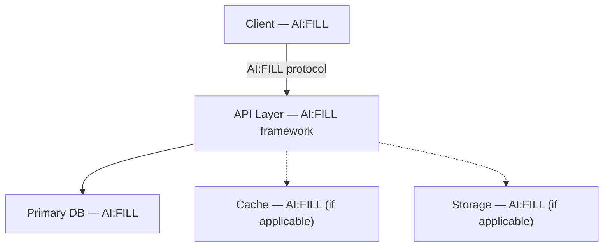

# Architecture Overview

> Project-level. Per-feature technical designs reference this instead of repeating it.
> **AI:** Read project structure, framework config, docker-compose, and infra files to populate.

---

## System diagram

<!-- AI:FILL — Generate from actual project dependencies and infrastructure -->

> _Example architectures:_
> - Monolith: Client → API → DB
> - With cache: Client → API → DB + Redis
> - Microservices: Client → Gateway → Service A / Service B → DB
> - Serverless: Client → API Gateway → Lambda → DynamoDB
> - Full-stack SSR: Browser → Next.js → API routes → DB

---

## Layer responsibilities

<!-- AI:FILL — from project directory structure and framework conventions -->

| Layer | Responsibility |
| - | - |
| <!-- AI:FILL --> | |

> _Common patterns:_
> | Pattern | Layers |
> | - | - |
> | MVC | Controller → Service → Model |
> | Clean Architecture | Controller → Use-case → Repository → Entity |
> | NestJS-style | Controller → Service → Repository |
> | Django-style | View → Serializer → Model |
> | Rails-style | Controller → Model (ActiveRecord) |
> | Go-style | Handler → Service → Store |

---

## Auth model

> See `_common/api-conventions.md` for token format.

<!-- AI:FILL — from role definitions, guards, RBAC/ABAC config, or user entity -->

| Role | Description |
| - | - |
| <!-- AI:FILL --> | |

> _Examples:_
> - Simple: `guest` · `user` · `admin`
> - RBAC: `viewer` · `editor` · `owner` · `admin`
> - Multi-tenant: `tenant_user` · `tenant_admin` · `super_admin`
> - Permission-based: roles with granular permissions (`read:posts`, `write:posts`)

---

## Observability standards

<!-- AI:FILL — from logging config, metrics setup, or APM integration -->

| Signal | Format | When |
| - | - | - |
| <!-- AI:FILL --> | | |

> _Examples:_
> - Structured JSON logs (Winston / Pino / Bunyan / Logrus)
> - `event.name { key: value }` plain format
> - OpenTelemetry traces + Prometheus metrics
> - Datadog / New Relic / Sentry APM
> - Simple `console.log` (early stage)

---

## Deployment

<!-- AI:FILL — from CI/CD config, Dockerfile, or infra-as-code -->

> _Examples:_
> - Zero-downtime rolling deploy (Kubernetes)
> - Blue-green deployment (AWS ECS)
> - Serverless auto-deploy (Vercel / Netlify / AWS Lambda)
> - Docker Compose on single server
> - Manual deploy via SSH
