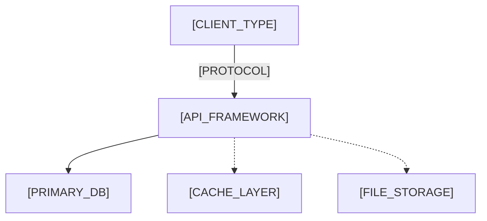

# Architecture Overview

**Version**: [VERSION] | **Last Amended**: [DATE]
**References**: [API Conventions](./api-conventions.md)

> Project-level. Per-feature technical designs reference this instead of repeating it.

<!--
  ACTION REQUIRED: Populate from project structure, framework config,
  docker-compose, and infra files.
-->

## System diagram

<!-- ACTION REQUIRED: Generate from actual project dependencies. -->

## Layer responsibilities

<!-- ACTION REQUIRED: From project directory structure and framework conventions. -->

| Layer | Responsibility |
| - | - |
| [LAYER_NAME] | [LAYER_RESPONSIBILITY] |

## Auth model

> See `_common/api-conventions.md` for token format.

<!-- ACTION REQUIRED: From role definitions, guards, RBAC/ABAC config, or user entity. -->

| Role | Description |
| - | - |
| `[ROLE_NAME]` | [ROLE_DESCRIPTION] |

## Observability standards

<!-- ACTION REQUIRED: From logging config, metrics setup, or APM integration. -->

| Signal | Format | When |
| - | - | - |
| [SIGNAL_TYPE] | [LOG_FORMAT] | [TRIGGER_CONDITION] |
