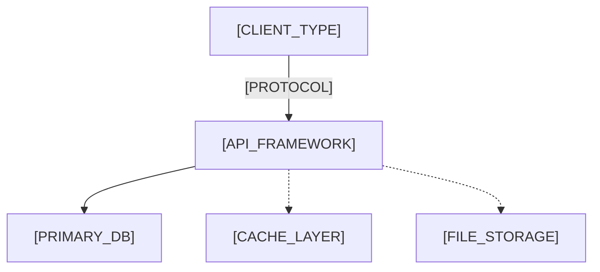

# Architecture Overview

> Project-level. Per-feature technical designs reference this instead of repeating it.

<!--
  ACTION REQUIRED: Read project structure, framework config, docker-compose, and
  infra files from codebase to populate all [PLACEHOLDER] sections below.
-->

## System diagram

<!--
  ACTION REQUIRED: Generate from actual project dependencies and infrastructure.
  Example architectures:
  - Monolith: Client → API → DB
  - With cache: Client → API → DB + Redis
  - Microservices: Client → Gateway → Service A / Service B → DB
  - Serverless: Client → API Gateway → Lambda → DynamoDB
  - Full-stack SSR: Browser → Next.js → API routes → DB
-->

## Layer responsibilities

<!--
  ACTION REQUIRED: Identify from project directory structure and framework conventions.
  Common patterns:
  - MVC: Controller → Service → Model
  - Clean Architecture: Controller → Use-case → Repository → Entity
  - NestJS-style: Controller → Service → Repository
  - Django-style: View → Serializer → Model
  - Rails-style: Controller → Model (ActiveRecord)
  - Go-style: Handler → Service → Store
-->

| Layer | Responsibility |
| - | - |
| [LAYER_NAME] | [LAYER_RESPONSIBILITY] |

## Auth model

> See `_common/api-conventions.md` for token format.

<!--
  ACTION REQUIRED: Extract from role definitions, guards, RBAC/ABAC config, or user entity.
  Examples:
  - Simple: guest, user, admin
  - RBAC: viewer, editor, owner, admin
  - Multi-tenant: tenant_user, tenant_admin, super_admin
  - Permission-based: roles with granular permissions (read:posts, write:posts)
-->

| Role | Description |
| - | - |
| `[ROLE_NAME]` | [ROLE_DESCRIPTION] |

## Observability standards

<!--
  ACTION REQUIRED: Extract from logging config, metrics setup, or APM integration.
  Examples:
  - Structured JSON logs (Winston / Pino / Bunyan / Logrus)
  - event.name { key: value } plain format
  - OpenTelemetry traces + Prometheus metrics
  - Datadog / New Relic / Sentry APM
  - Simple console.log (early stage)
-->

| Signal | Format | When |
| - | - | - |
| [SIGNAL_TYPE] | [LOG_FORMAT] | [TRIGGER_CONDITION] |

## Deployment

<!--
  ACTION REQUIRED: Extract from CI/CD config, Dockerfile, or infra-as-code.
  Examples:
  - Zero-downtime rolling deploy (Kubernetes)
  - Blue-green deployment (AWS ECS)
  - Serverless auto-deploy (Vercel / Netlify / AWS Lambda)
  - Docker Compose on single server
  - Manual deploy via SSH
-->

- [DEPLOYMENT_STRATEGY]
- [MIGRATION_STRATEGY]
- [ROLLBACK_STRATEGY]
