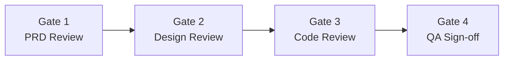

# Review Gates

**Version**: [VERSION] | **Last Amended**: [DATE]

> Project-level. Defines who reviews what, at which phase, and approval criteria.
> Every feature must pass all gates in order before merge.

<!-- ACTION REQUIRED: Adjust roles, reviewers, and criteria to match your team's workflow. -->

## Gate Flow

## Gate 1 — PRD Review

> Before starting technical design.

| Item | Details |
| - | - |
| **Trigger** | PRD (`01_PRD.md`) marked "In Review" |
| **Reviewer(s)** | [PRD_REVIEWERS: e.g. Product Owner, Tech Lead] |
| **Artifacts reviewed** | `01_PRD.md` |

### Checklist

- [ ] Problem statement is clear and scoped
- [ ] All FRs have priority assigned (P0 / P1 / P2)
- [ ] NFRs have measurable metrics
- [ ] Acceptance criteria cover happy path + key edge cases
- [ ] No `NEEDS CLARIFICATION` items remain unresolved
- [ ] Success metrics are measurable and realistic
- [ ] Non-goals are explicitly stated

### Exit criteria

- [ ] All checklist items pass
- [ ] PRD status changed to "Approved"
- [ ] Open questions resolved or deferred with owner assigned

---

## Gate 2 — Design Review

> Before starting implementation.

| Item | Details |
| - | - |
| **Trigger** | Technical design (`03_technical-design.md`) marked "In Review" |
| **Reviewer(s)** | [DESIGN_REVIEWERS: e.g. Tech Lead, Senior Dev, Security Champion] |
| **Artifacts reviewed** | `02_change-impact.md`, `03_technical-design.md`, `06_ADR-*.md` (if any) |

### Checklist

- [ ] Data model is complete — all entities, fields, constraints, relationships
- [ ] Migration is backward-compatible (up and down)
- [ ] API endpoints match FRs from PRD
- [ ] Authorization rules defined for every endpoint
- [ ] Sequence diagrams cover non-trivial flows
- [ ] Change impact assessed — breaking changes documented with migration plan
- [ ] Security checklist from `security-baseline.md` addressed
- [ ] ADR created for any significant technical decision

### Exit criteria

- [ ] All checklist items pass
- [ ] Technical design status changed to "Approved"
- [ ] Risk register reviewed — no unmitigated 🔴 High risks

---

## Gate 3 — Code Review

> Before merging to main/develop branch.

| Item | Details |
| - | - |
| **Trigger** | Pull Request / Merge Request created |
| **Reviewer(s)** | [CODE_REVIEWERS: e.g. minimum 1 peer + 1 senior] |
| **Artifacts reviewed** | Source code, tests, migration files |

### Checklist

- [ ] Code matches approved technical design
- [ ] Unit tests cover business logic (coverage ≥ target from `test-strategy.md`)
- [ ] API tests cover all status codes per endpoint
- [ ] No hardcoded secrets or credentials
- [ ] Input validation at API boundary
- [ ] Authorization checks on every mutating endpoint
- [ ] Error handling follows `api-conventions.md`
- [ ] Logging follows `architecture.md` observability standards
- [ ] No console.log / debug code left in production paths
- [ ] Migration tested (up + down)

### Exit criteria

- [ ] All checklist items pass
- [ ] CI pipeline green (lint + test + build)
- [ ] Required number of approvals received
- [ ] All review comments resolved

---

## Gate 4 — QA Sign-off

> Before marking feature as shippable.

| Item | Details |
| - | - |
| **Trigger** | Code merged to test/staging branch |
| **Reviewer(s)** | [QA_REVIEWERS: e.g. QA Engineer, Product Owner] |
| **Artifacts reviewed** | `04_test-plan.md`, `05_traceability-matrix.md`, test results |

### Checklist

- [ ] All test cases from `04_test-plan.md` executed
- [ ] Traceability matrix — every FR mapped to passing test
- [ ] No open Critical / High bugs
- [ ] Regression suite passes 100%
- [ ] Feature-specific exit criteria from test plan met
- [ ] Global DoD from `test-strategy.md` met

### Exit criteria

- [ ] All checklist items pass
- [ ] Traceability matrix status updated (all ✅)
- [ ] QA sign-off recorded

---

## Summary Matrix

| Gate | When | Who | Key artifact | Block if fail? |
| - | - | - | - | - |
| G1 — PRD | Before design | [PRD_REVIEWERS] | `01_PRD.md` | Yes — cannot start design |
| G2 — Design | Before code | [DESIGN_REVIEWERS] | `03_technical-design.md` | Yes — cannot start implementation |
| G3 — Code | Before merge | [CODE_REVIEWERS] | PR / MR | Yes — cannot merge |
| G4 — QA | Before ship | [QA_REVIEWERS] | `05_traceability-matrix.md` | Yes — cannot ship |
