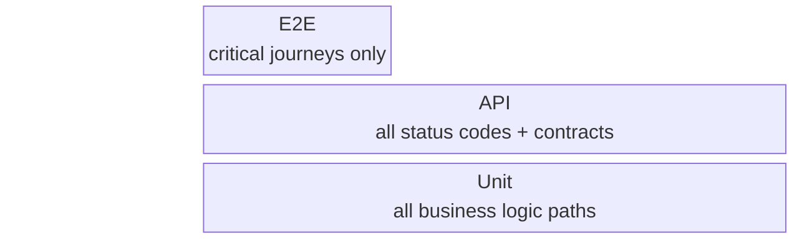

# Test Strategy

> Project-level. Applies to all features. Per-feature test plans only define test cases.
> **AI:** Read test config files (jest.config, vitest.config, pytest.ini, etc.), CI pipeline, and existing test suites to populate.

---

## Test pyramid



<!-- AI:FILL — from test runner config and existing test files -->

| Layer | Focus | Tooling | Coverage target |
| - | - | - | - |
| Unit | Business logic, edge cases | <!-- AI:FILL --> | <!-- AI:FILL --> |
| API / Integration | Contracts, DB side-effects | <!-- AI:FILL --> | <!-- AI:FILL --> |
| E2E | User journeys | <!-- AI:FILL --> | <!-- AI:FILL --> |
| Performance | Latency, throughput | <!-- AI:FILL --> | <!-- AI:FILL --> |
| Regression | Existing features unbroken | Full suite | 100% pass |

> _Tooling examples:_
> - Unit: Jest · Vitest · Mocha · pytest · JUnit · Go testing · RSpec
> - API: Supertest · Pactum · httptest · REST Assured · requests
> - E2E: Playwright · Cypress · Puppeteer · Selenium · Detox (mobile)
> - Performance: k6 · Locust · Artillery · JMeter · wrk

---

## Environments

<!-- AI:FILL — from environment config / docker-compose / CI pipeline -->

| Environment | Purpose | Data |
| - | - | - |
| <!-- AI:FILL --> | | |

> _Examples:_
> | Env | Purpose | Data |
> | - | - | - |
> | `local` | Unit + Integration | In-memory / test DB / SQLite |
> | `ci` | Automated suite | Ephemeral containers |
> | `staging` | E2E + Performance | Seeded clone of prod schema |
> | `production` | Post-deploy smoke | Read-only, minimal |

---

## Global entry criteria

<!-- AI:FILL — adjust to project workflow -->

Testing does not start until:
- [ ] <!-- AI:FILL -->

> _Examples:_
> - Technical design approved
> - Code merged to test branch
> - Staging environment healthy
> - Test data seeded
> - Feature flag enabled in test env
> - Dependencies deployed

## Global exit criteria (Definition of Done)

<!-- AI:FILL — adjust to project standards -->

Feature is not shippable until:
- [ ] <!-- AI:FILL -->

> _Examples:_
> - All P0 tests pass
> - No open Critical / High bugs
> - Unit coverage ≥ target %
> - Regression suite 100% pass
> - Traceability matrix — all FRs mapped to passing tests
> - Security scan clean
> - Performance within NFR targets

---

## Standard test case ID format

<!-- AI:FILL — adapt prefix convention to project -->

```
TC-U-XXX   Unit test
TC-A-XXX   API / Integration test
TC-E-XXX   E2E test
TC-P-XXX   Performance test
TC-R-XXX   Regression test
```

> _Alternative formats: `TEST-001` · `[feature]-unit-001` · Auto-generated by framework_
