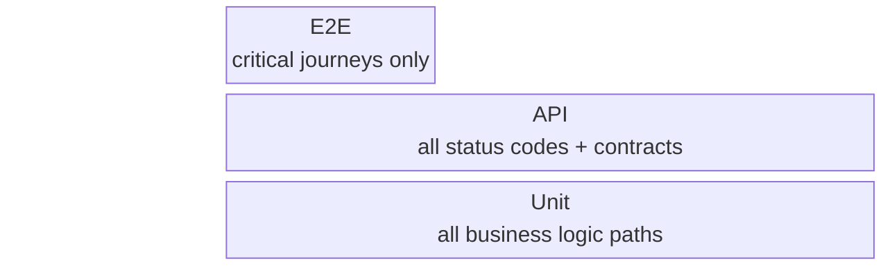

# Test Strategy

**Version**: [VERSION] | **Last Amended**: [DATE]

> Project-level. Applies to all features. Per-feature test plans only define test cases.

<!--
  ACTION REQUIRED: Populate from test config files, CI pipeline,
  and existing test suites.
-->

## Test pyramid



<!-- ACTION REQUIRED: Fill tooling and coverage targets from test runner config. -->

| Layer | Focus | Tooling | Coverage target |
| - | - | - | - |
| Unit | Business logic, edge cases | [UNIT_TEST_TOOLING] | [UNIT_COVERAGE_TARGET] |
| API / Integration | Contracts, DB side-effects | [API_TEST_TOOLING] | [API_COVERAGE_TARGET] |
| E2E | User journeys | [E2E_TEST_TOOLING] | [E2E_COVERAGE_TARGET] |
| Performance | Latency, throughput | [PERF_TEST_TOOLING] | [PERF_CRITERIA] |
| Regression | Existing features unbroken | Full suite | 100% pass |

## Environments

<!-- ACTION REQUIRED: From environment config / docker-compose / CI pipeline. -->

| Environment | Purpose | Data |
| - | - | - |
| `[ENV_NAME]` | [ENV_PURPOSE] | [DATA_STRATEGY] |

## Global entry criteria

<!-- ACTION REQUIRED: Adjust to project workflow. -->

Testing does not start until:
- [ ] [ENTRY_CRITERION_1]
- [ ] [ENTRY_CRITERION_2]

## Global exit criteria (Definition of Done)

<!-- ACTION REQUIRED: Adjust to project standards. -->

Feature is not shippable until:
- [ ] [EXIT_CRITERION_1]
- [ ] [EXIT_CRITERION_2]

## Standard test case ID format

<!-- ACTION REQUIRED: Adapt prefix convention to project. -->

```
TC-U-XXX   Unit test
TC-A-XXX   API / Integration test
TC-E-XXX   E2E test
TC-P-XXX   Performance test
TC-R-XXX   Regression test
```
