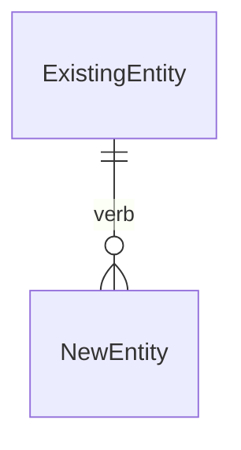

# Technical Design — [Feature Name]

| | |
| - | - |
| **Author** | |
| **Status** | Draft · In Review · Approved |
| **Created** | YYYY-MM-DD |
| **References** | [PRD](./PRD.md) · [API Conventions](../../_common/api-conventions.md) · [Architecture](../../_common/architecture.md) |

---

## Overview

> How does this feature fit into the existing system? One short paragraph.

---

## Data model

### New / modified entities

**`[EntityName]`** — _new · modified_

| Field | Type | Constraints | Notes |
| - | - | - | - |
| `id` | uuid | PK | |
| | | | |

### Relationships



### Migration

```sql
-- Up

-- Down
```

---

## API

> Conventions (auth, errors, pagination) → [`_common/api-conventions.md`](../../_common/api-conventions.md)
> Full contracts (request/response shapes) → defined in source: `<!-- AI:FILL — path to controller/route file -->`
> Live spec (after running dev server) → `<!-- AI:FILL — Swagger/OpenAPI URL if applicable -->`

### Endpoints

<!-- AI:FILL — from route definitions in source code -->

| Method | Path | Description | Auth |
| - | - | - | - |
| <!-- AI:FILL --> | | | |

> _Examples:_
> | Method | Path | Description | Auth |
> | - | - | - | - |
> | `GET` | `/resources` | List | Required |
> | `POST` | `/resources` | Create | Required |
> | `GET` | `/resources/:id` | Get by ID | Required |
> | `PATCH` | `/resources/:id` | Update | Required |
> | `DELETE` | `/resources/:id` | Delete | Required |
> | `POST` | `/resources/:id/approve` | Custom action | Admin |
> | `GET` | `/resources/search` | Search | Optional |

### Request / Response notes

> Only document non-obvious shapes or constraints not expressible in code annotations.
> Standard CRUD shapes → skip this section.

### Authorization

<!-- AI:FILL — from guards / decorators / middleware -->

| Action | Required role | Extra check |
| - | - | - |
| <!-- AI:FILL --> | | |

> _Examples:_
> | Action | Required role | Extra check |
> | - | - | - |
> | List | `user` | Own resources only |
> | Create | `user` | — |
> | Update | `user` | Must be owner |
> | Delete | `admin` | — |
> | Approve | `admin` | Status must be `pending` |

---

## Business logic

> Only document non-obvious rules. Skip if it's standard CRUD.

### `create(userId, input)`

```
1. [Non-obvious step]
2. [Non-obvious step]
```

### `update(userId, id, input)`

```
1. [Non-obvious step]
```

---

## Frontend

> Skip sections that follow standard patterns.

### Screens

<!-- AI:FILL — from page/route definitions in frontend source -->

| Screen | Route | Rendering |
| - | - | - |
| <!-- AI:FILL --> | | |

> _Examples:_
> | Screen | Route | Rendering |
> | - | - | - |
> | List | `/resources` | SSR / ISR / CSR |
> | Detail | `/resources/:id` | SSR |
> | Form | `/resources/new` · `/resources/:id/edit` | CSR |
> | Dashboard | `/dashboard` | SSR + client hydration |

### Non-standard data flow

> Only document if it deviates from the standard fetch → display → mutate pattern.

---

## Observability

> Only document feature-specific signals. Global signals → [`_common/architecture.md`](../../_common/architecture.md)

<!-- AI:FILL — from logging/metrics in feature source code -->

| Signal | Event | When |
| - | - | - |
| <!-- AI:FILL --> | | |

> _Examples:_
> | Signal | Event | When |
> | - | - | - |
> | Log INFO | `resource.created { id, userId }` | On create |
> | Log WARN | `resource.update_conflict { id }` | On conflict |
> | Metric | `resource_created_total` | On create |

---

## Open questions

| # | Question | Owner | Status |
| - | - | - | - |
| 1 | | | Open |
