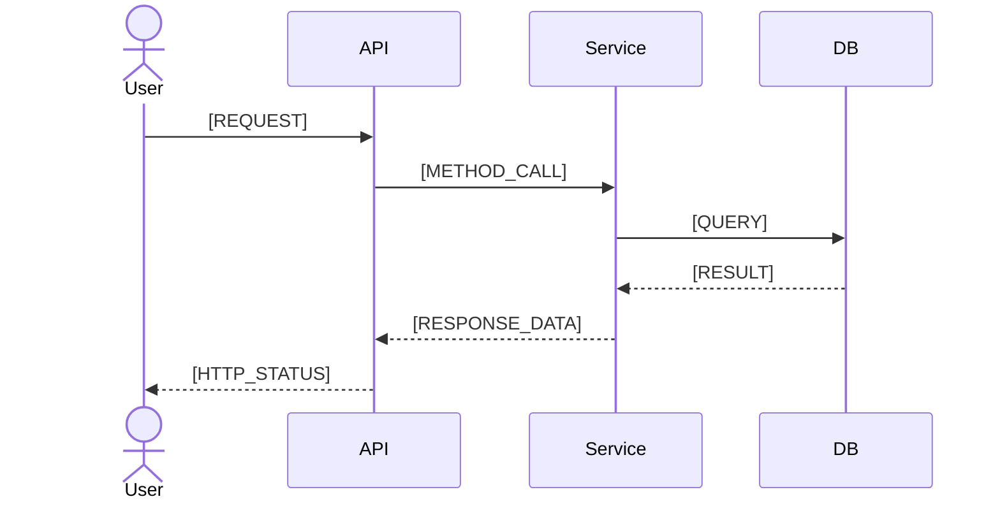

# Technical Design — [FEATURE_NAME]

**Author**: [AUTHOR]
**Status**: [Draft / In Review / Approved]
**References**: [PRD](./01_PRD.md), [Change Impact](./02_change-impact.md), [API Conventions](../../_common/api-conventions.md), [Architecture](../../_common/architecture.md), [Security Baseline](../../_common/security-baseline.md)
**Created**: [DATE]

## Overview

<!--
  ACTION REQUIRED: How does this feature fit into the existing system? One short paragraph.
-->

[FEATURE_OVERVIEW]

## Data model (OPTIONAL - only if DB schema changes) ⚠️

### New / modified entities

<!-- ACTION REQUIRED: List new or modified entities. e.g. **Task** — new: id (uuid, PK), title (varchar 255, NOT NULL), status (enum) -->

**`[ENTITY_NAME]`** — _new / modified_

| Field | Type | Constraints | Notes |
| - | - | - | - |
| `id` | [TYPE] | PK | |
| [FIELD_NAME] | [TYPE] | [CONSTRAINTS] | [NOTES] |

### Relationships

<!-- ACTION REQUIRED: Define ER relationships. Syntax: ||--o{ (1:N), ||--|| (1:1), }o--o{ (M:N) -->

```mermaid
erDiagram
    [EXISTING_ENTITY] ||--o{ [NEW_ENTITY] : "[VERB]"
```

### Migration (OPTIONAL - only if new/altered tables) ⚠️

```sql
-- Up
[UP_MIGRATION_SQL]

-- Down
[DOWN_MIGRATION_SQL]
```

## API (OPTIONAL - only if feature exposes or modifies endpoints) ⚠️

> Conventions (auth, errors, pagination) → [`_common/api-conventions.md`](../../_common/api-conventions.md)
> Full contracts (request/response shapes) → defined in source: `[SOURCE_FILE_PATH]`
> Live spec (after running dev server) → `[API_DOCS_URL]`

### Endpoints

<!-- ACTION REQUIRED: List all endpoints from route definitions. e.g. GET /tasks — List all, auth required; POST /tasks — Create, auth required -->

| Method | Path | Description | Auth |
| - | - | - | - |
| `[METHOD]` | `[PATH]` | [DESCRIPTION] | [AUTH_REQUIREMENT] |

### Request / Response notes

> Only document non-obvious shapes or constraints not expressible in code annotations.
> Standard CRUD shapes → skip this section.

### Authorization

<!-- ACTION REQUIRED: From guards / decorators / middleware. e.g. Create → role: user, own scope only; Approve → role: admin, status must be pending -->

| Action | Required role | Extra check |
| - | - | - |
| [ACTION] | `[ROLE]` | [EXTRA_CHECK] |

## Business logic (OPTIONAL - skip if standard CRUD) ⚠️

<!-- ACTION REQUIRED: Document non-obvious business logic steps. e.g. 1. Validate title uniqueness within user scope → CONFLICT if duplicate -->

### `[METHOD_SIGNATURE]`

```
1. [STEP_DESCRIPTION]
2. [STEP_DESCRIPTION]
```

## Sequence Diagrams (OPTIONAL - skip for standard CRUD) ⚠️

> Document runtime data flow for non-trivial operations.

<!--
  ACTION REQUIRED: Create sequence diagrams for flows involving:
  multiple services, async operations, complex auth, conditional branching,
  background jobs, or external system integrations.
-->

### [FLOW_NAME]



## Frontend (OPTIONAL - only if feature has UI) ⚠️

### Screens

<!-- ACTION REQUIRED: From page/route definitions. e.g. List /tasks (SSR), Detail /tasks/:id (CSR), Form /tasks/new (CSR) -->

| Screen | Route | Rendering |
| - | - | - |
| [SCREEN_NAME] | `[ROUTE]` | [RENDER_STRATEGY] |

### Non-standard data flow

> Only document if it deviates from the standard fetch → display → mutate pattern.

## Observability (OPTIONAL - only if feature-specific signals needed) ⚠️

> Only document feature-specific signals. Global signals → [`_common/architecture.md`](../../_common/architecture.md)

<!-- ACTION REQUIRED: From logging/metrics. e.g. LOG INFO resource.created {id, userId}; METRIC resource_created_total -->

| Signal | Event | When |
| - | - | - |
| [SIGNAL_TYPE] | `[EVENT_NAME] { [PAYLOAD] }` | [TRIGGER] |

## Open questions (OPTIONAL - if unresolved items remain) ⚠️

| # | Question | Owner | Status |
| - | - | - | - |
| 1 | | | Open |
